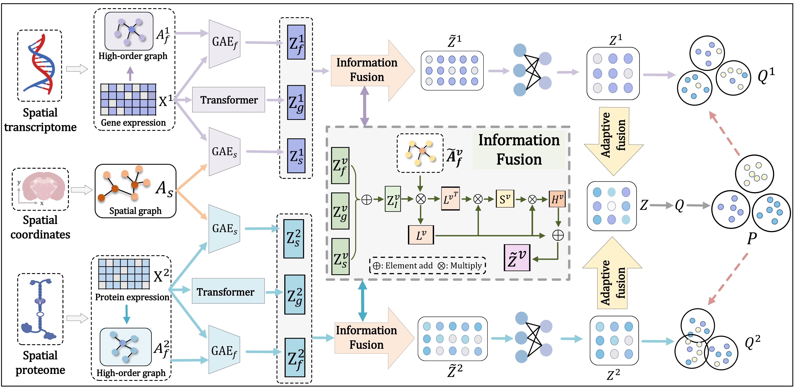

# smows

A multi-level fusion model for clustering spatial multi-omics data.



**Author**: kyochilian  
**Email**: kyochilian@gmail.com  
**Date**: 2026.02

## Overview

smows (formerly SpaFusion) is a deep learning framework that integrates spatial multi-omics data (e.g., RNA + Protein) using a combination of Graph Convolutional Networks (GCN) and Transformers. The model performs multi-level fusion to enable effective clustering of spatial omics data.

## Features

- **Multi-level Fusion**: Combines GCN spatial/feature encoding with Transformer-based encoding
- **Modular Architecture**: Easy to modify models, datasets, and run ablation experiments
- **Flexible Configuration**: Centralized config system for quick parameter switching
- **WandB Integration**: Comprehensive experiment tracking and logging

## Requirements

smows is implemented in PyTorch and requires CUDA for optimal performance.

```bash
conda env create -f environment.yml
```

Or install manually:
```bash
pip install torch scanpy pandas numpy scipy sklearn munkres wandb
```

## Project Structure

```
SpaFusion/
├── config.py              # Centralized configuration
├── main.py                # Main training script
├── models/                # Modular model components
│   ├── __init__.py
│   ├── gcn.py            # GCN encoder/decoder
│   ├── transformer.py    # Transformer encoder/decoder
│   └── fusion.py         # Main SpaFusion model
├── datasets/              # Dataset utilities
│   └── __init__.py
├── processing.py          # Data preprocessing
├── utils.py               # Utility functions
├── evaluate.py            # Evaluation metrics
├── high_order_matrix.py   # High-order graph construction
└── encoder.py             # (Legacy compatibility layer)
```

## Usage

### Basic Usage

Run training on the default dataset (Human_lymph_node_D1):

```bash
python main.py
```

### Configuration Options

The configuration is centralized in `config.py`. You can:

1. **Switch datasets**: Modify the dataset name in `main.py` or create new dataset configs in `config.py`
2. **Change model architecture**: Update `MODEL_CONFIGS` in `config.py`
3. **Adjust hyperparameters**: Modify `TRAINING` configurations

### Command Line Arguments

```bash
python main.py --name D1 \
               --seed 0 \
               --spatial_k 9 \
               --adj_k 20 \
               --lambda1 1.0 \
               --lambda2 0.1 \
               --lr 0.002 \
               --pretrain_epoch 10000 \
               --train_epoch 350 \
               --use_wandb
```

### Running Ablation Studies

The config system supports easy ablation experiments:

```python
# In config.py, use predefined ablation configs:
TRAINING = {
    'ablation_no_kl': {...},          # Disable KL divergence
    'ablation_no_consistency': {...},  # Disable consistency loss
}
```

## Modular Design

### Adding a New Dataset

1. Add configuration to `config.py`:
```python
DATASETS = {
    'MyDataset': {
        'name': 'my_dataset_name',
        'data_path': './data/my_data/',
        'label_file': 'labels.csv',
        ...
    }
}
```

2. Run with: `python main.py --name MyDataset`

### Modifying the Model

All model components are in the `models/` directory:
- `models/gcn.py`: Modify GCN layers
- `models/transformer.py`: Modify Transformer layers  
- `models/fusion.py`: Modify fusion strategy

### Switching Components

Easy to swap or disable components for ablation:
- Remove Transformer: Modify `models/fusion.py` forward method
- Change GCN depth: Update layer counts in `models/gcn.py`
- Adjust fusion weights: Modify `emb_fusion()` in `models/fusion.py`

## Results

Results are saved in `./results/{dataset_name}/{timestamp}/`:
- Training logs
- Performance metrics (CSV)
- Predicted labels
- Latent embeddings
- Spatial coordinates

## Evaluation Metrics

The model reports:
- **ACC**: Clustering Accuracy
- **F1**: F1-score
- **NMI**: Normalized Mutual Information
- **ARI**: Adjusted Rand Index
- **AMI**: Adjusted Mutual Information
- **VMS**: V-Measure Score
- **FMS**: Fowlkes-Mallows Score

## Citation

If you use SpaFusion in your research, please cite:

```
[Citation details to be added]
```

## License

[License to be determined]

## Contact

For questions or issues, please contact:
- **Author**: kyochilian
- **Email**: kyochilian@gmail.com
